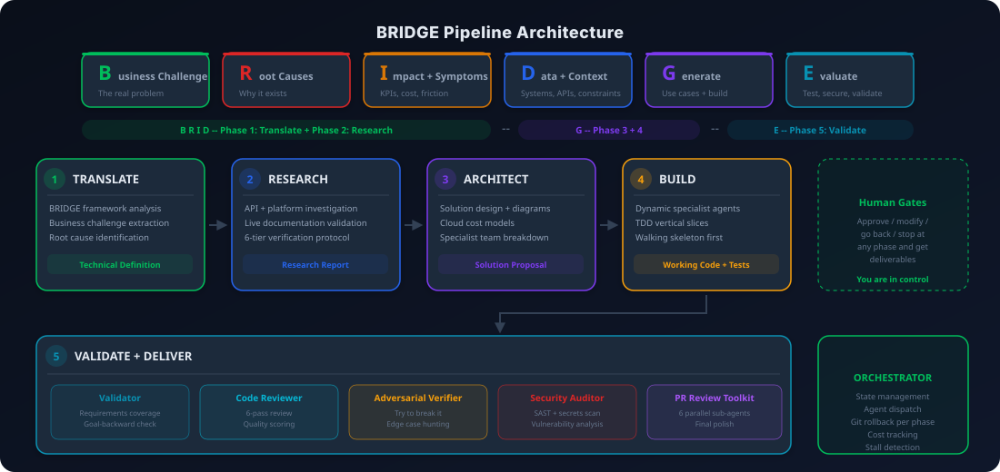
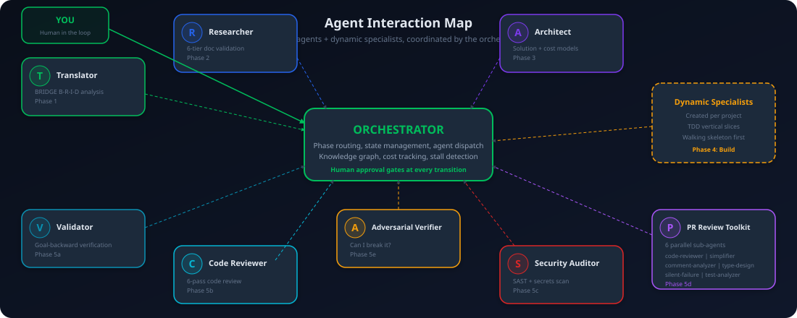

<div align="center">

<a href="https://www.buymeacoffee.com/josembuitron" target="_blank">

</a>

</div>

<br/>

[](https://opensource.org/licenses/MIT)
[](https://claude.com/claude-code)
[](https://github.com/josembuitron/bridge-agentic-pipeline)
[](CHANGELOG.md)

# BRIDGE Agentic Pipeline

**Turn business requirements into delivered technical solutions, automatically.**

Most AI development tools help you write code faster. Bridge does something different: it takes a messy meeting transcript, a client email, or a rough product brief and runs it through a structured pipeline that translates requirements, researches technologies, designs architecture, builds the solution, and validates everything before delivery. You get working code, client-ready proposals, and architecture diagrams -- not just autocomplete suggestions. It is the difference between an AI assistant and an AI development team.

<div align="center">

</div>

> See [CHANGELOG.md](CHANGELOG.md) for release notes. Current release: 2.0.0.

---

## Who This Is For

| You are a... | Bridge helps you... |
|---|---|
| **Development agency** | Go from client call to delivered proposal in hours, not weeks |
| **Consultancy / advisory firm** | Generate technology assessments and solution proposals with real cost models |
| **Fractional CTO / engineering lead** | Run a full development pipeline solo -- Bridge acts as your analyst, researcher, architect, and QA team |
| **Startup founder** | Build your MVP with enterprise-grade process without the enterprise-grade team |
| **Freelance developer** | Deliver professional proposals and architecture docs that justify premium rates |
| **Data engineering team** | Design ETL pipelines, API integrations, and dashboard architectures with validated tech stacks |
| **System integrator** | Connect platforms (NetSuite, Salesforce, Dynamics 365) with researched, documented approaches |

---

## How It Works

```
 INPUT                    PIPELINE                                    OUTPUT
 -----                    --------                                    ------

 Meeting transcript   +-----------------------------------------+   Client-ready
 Client email         |  Phase 0.5: DISCOVERY interview         |   deliverables
 Product brief  --->  |  Phase 1: TRANSLATE (BRIDGE B-R-I-D)    | ---> Solution proposals
 Chat messages        |  Phase 2: RESEARCH technologies         |   Architecture diagrams
 Requirements doc     |  Phase 3: ARCHITECT solution            |   Working code + tests
                      |  Phase 4: BUILD (vertical slices + TDD) |   Deployment guides
                      |  Phase 5: VALIDATE and deliver          |   Quality reports
                      +-----------------------------------------+

 Human approval gates at EVERY phase. Stop at any point and get deliverables.
```

### The Five Phases

| Phase | What Happens | What You Get |
|---|---|---|
| **0.5 -- Discover** | Optional structured interview locks identity, business outcome, stack, quality posture, delivery constraints, branding into `pipeline/00-constraints.md`. You can skip the whole thing or per category. | Locked Facts that downstream agents treat as non-negotiable |
| **1 -- Translate** | Raw input analyzed through the BRIDGE framework. Business challenges, root causes, impact metrics, and data context extracted. | Technical Definition + BRIDGE Analysis |
| **2 -- Research** | APIs, platforms, and technologies investigated using live documentation. Claims from Phase 1 validated against real-world data. | Research Report with verified tech stack |
| **3 -- Architect** | Complete solution designed with architecture diagrams, cloud cost models, specialist team breakdown, and vertical slices. | Solution Proposal + Mermaid diagrams |
| **4 -- Build** | Dynamic specialist agents execute each vertical slice using TDD. Walking skeleton first, then incremental hardening. | Working code, tests, build manifest |
| **5 -- Validate** | Goal-backward verification, 6-pass code review, SAST security scanning, secrets detection, and quality scoring. | Validation report + client deliverables |

You control the pipeline at every step. Approve, modify, go back, or stop and generate deliverables from whatever is complete. The most common exit point is Phase 3 -- perfect for generating client proposals without writing code.

### Agent Interaction Map

<div align="center">

</div>

---

## The BRIDGE Framework

BRIDGE is a structured methodology for translating business problems into technical solutions. It ensures every project starts from the real problem, not from a premature technology choice.

| Letter | Phase | Owner | Purpose |
|---|---|---|---|
| **B** | Business Challenge | Translator | What was said vs. what is actually needed |
| **R** | Root Causes | Translator | Causal analysis -- why the problem exists |
| **I** | Impact & Symptoms | Translator | KPIs, financial exposure, operational friction |
| **D** | Data & Context | Translator + Researcher | Systems, APIs, constraints (preliminary, then validated) |
| **G** | Generate Use Cases | Architect | 3-5 technical use cases mapped to root causes |
| **E** | Evaluate Feasibility | Architect | Viability, complexity, timeline, risk for each use case |

Rather than concentrating all analysis in one agent, BRIDGE phases are distributed where each agent has the right expertise:

```
B --- R --- I --- D(prelim)          D(validated)          G --- E
|--------------------------|         |--------------|      |--------------|
      Phase 1: Translator             Phase 2: Researcher    Phase 3: Architect
      (business analysis)             (tech validation)      (solution design)
```

Read the original article: **[Why Some AI Projects Start with the Wrong Problem](https://www.linkedin.com/pulse/why-some-ai-projects-start-wrong-problem-jose-milton-buitron-4bbme/)**

---

## Commands Summary

| Command | What It Does |
|---|---|
| `/bridge` | Start a new project or continue an existing one |
| `/bridge help` | Show setup and configuration guide |
| `/bridge list` | List all projects with status |
| `/bridge health` | Diagnostic checks on the most recent project |
| `/bridge dream {client}` | Consolidate a client's knowledge graph across projects |
| `node scripts/bridge.js doctor` | Detect installed tools from outside Claude Code |
| `node scripts/bridge.js status` | Report state of every project under `clients/` |

See [docs/COMMANDS.md](docs/COMMANDS.md) for every command, option, configuration knob, and project preset.

---

## Quick Start

### Prerequisites

- [Claude Code CLI](https://claude.com/claude-code) installed and authenticated
- Node.js 18+ and Python 3.10+

### Installation

```bash
git clone https://github.com/josembuitron/bridge-agentic-pipeline.git
cd bridge-agentic-pipeline && bash install.sh
```

Restart Claude Code, then type: `/bridge`

To update:
```bash
cd bridge-agentic-pipeline && git pull && bash install.sh
```

To uninstall:
```bash
rm -rf ~/.claude/skills/bridge
```

### Alternative: Plugin Install (for teams)

If your team needs managed distribution with namespaced commands:

```
# Inside Claude Code:
/plugin marketplace add josembuitron/bridge-agentic-pipeline
/plugin install bridge-dev-pipeline@josembuitron-bridge-agentic-pipeline
/reload-plugins
```

Plugin invocation: `/bridge-dev-pipeline:bridge` (namespaced per Claude Code convention).

### Alternative: Test Without Installing

```bash
claude --plugin-dir ./bridge-agentic-pipeline
```

### Verify the install

```bash
node scripts/bridge.js doctor    # tool detection
npm test                          # structural tests
```

### First Run

When you invoke `/bridge`, the pipeline will:

1. **Discover tools** -- cross-platform detection with fallback chains (binary → module → import), auto-install via platform package manager (never blocks on optional tools)
2. **Collect input** -- paste text, provide file paths, or describe your project
3. **Confirm understanding** -- validate client name, project name, and problem interpretation before creating folders
4. **Discovery interview** -- 6-category structured interview (default on; you can skip the whole thing or per category)
5. **Run phases** -- each phase produces artifacts and waits for your approval

BRIDGE auto-installs missing CLI tools (crawl4ai, semgrep) on first run. See [SETUP.md](SETUP.md) for optional MCP servers and plugins that enhance the pipeline.

---

## Deep Documentation

This README is the landing page. The deep details live in `docs/`:

- **[docs/ARCHITECTURE.md](docs/ARCHITECTURE.md)** -- Orchestrator design, every phase in detail, critical thinking integration, harness engineering, resilience features, quality scoring, project output layout.
- **[docs/REFERENCE.md](docs/REFERENCE.md)** -- Every MCP server, CLI tool, Claude Code plugin, Trail of Bits security skill, the agent-to-tool matrix, and the 6-tier documentation access chain.
- **[docs/COMMANDS.md](docs/COMMANDS.md)** -- Every command, every configuration knob, every option at every gate, project type presets.
- **[SETUP.md](SETUP.md)** -- Detailed setup, MCP installation, plugin installation, troubleshooting.
- **[CHANGELOG.md](CHANGELOG.md)** -- Release notes per version.
- **[DISCLAIMER.md](DISCLAIMER.md)** -- Legal notice on pipeline-generated outputs.

---

## License

MIT License. See [LICENSE](LICENSE).

---

## Support

If BRIDGE saves you time or helps you deliver better work, consider supporting the project. Your contribution keeps this pipeline open-source and actively maintained.

<div align="center">

<a href="https://www.buymeacoffee.com/josembuitron" target="_blank">

</a>

</div>

<br/>

You can also sponsor on GitHub via the Sponsor button at the top of the [repository page](https://github.com/josembuitron/bridge-agentic-pipeline).

**Repository:** [github.com/josembuitron/bridge-agentic-pipeline](https://github.com/josembuitron/bridge-agentic-pipeline)

**Questions or feedback?** [Open an issue on GitHub](https://github.com/josembuitron/bridge-agentic-pipeline/issues).
