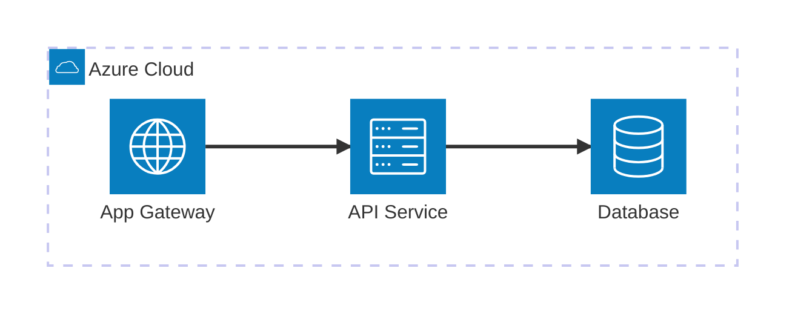

# Architecture Diagram Generation

Professional architecture diagrams with cloud provider icons, interactive zoom/pan, and multiple output formats.

## Tool Priority Chain

```
1. diagrams (Python)  → Cloud architecture with official icons (AWS/Azure/GCP/K8s)
2. D2 (d2lang)        → General architecture with icon URLs, container nesting
3. Remotion (React)   → Custom branded diagrams with React+SVG (if diagrams+D2 unavailable)
4. Excalidraw (MCP)   → Interactive diagrams with library icons (if MCP available)
5. Mermaid (fallback)  → Inline markdown diagrams (always available)
```

Use the FIRST available tool. Multiple tools can be used for different diagram types in the same project.

**Remotion is MANDATORY for branded visual assets** (hero slides, infographics) regardless of diagram tool availability. See `modules/remotion-renderer.md` for full integration guide.

---

## Tool 1: Mingrammer/Diagrams (Python) -- PRIMARY for Cloud Architecture

### Installation (auto-install in Phase 4 setup or Phase 3 if needed)

```bash
# Prerequisites
choco install graphviz -y 2>/dev/null || apt-get install -y graphviz 2>/dev/null || brew install graphviz 2>/dev/null
pip install diagrams
```

### When to Use
- Any diagram showing cloud services (Azure, AWS, GCP)
- Kubernetes cluster architecture
- Network topology with load balancers, firewalls, databases
- Multi-tier application architecture

### How Agents Generate Diagrams

The architect agent (or specialist agents) write a Python script:

```python
# {project-path}/scripts/generate-architecture.py
from diagrams import Diagram, Cluster, Edge
from diagrams.azure.compute import AppServices, FunctionApps, KubernetesServices
from diagrams.azure.database import CosmosDb, SQLDatabases, CacheForRedis
from diagrams.azure.network import LoadBalancers, ApplicationGateway, FrontDoors
from diagrams.azure.security import KeyVaults
from diagrams.azure.storage import BlobStorage, DataLakeStorage
from diagrams.azure.analytics import Databricks, SynapseAnalytics, DataFactory
from diagrams.azure.integration import APIManagement, ServiceBus
from diagrams.k8s.compute import Pod, Deploy, ReplicaSet
from diagrams.k8s.network import Ingress, Service

graph_attr = {
    "fontsize": "28",
    "fontname": "Segoe UI",
    "bgcolor": "white",
    "pad": "0.5",
    "nodesep": "0.8",
    "ranksep": "1.2"
}

with Diagram(
    "Project Architecture",
    show=False,
    outformat="svg",
    filename="{project-path}/deliverables/images/architecture",
    direction="LR",
    graph_attr=graph_attr
):
    # Agent fills this based on solution proposal
    pass
```

Then execute:
```bash
python {project-path}/scripts/generate-architecture.py
```

### Available Icon Providers

| Provider | Import Path | Icon Count | Examples |
|----------|------------|------------|---------|
| AWS | `diagrams.aws.*` | 200+ | EC2, S3, Lambda, RDS, EKS, SQS, SNS, CloudFront |
| Azure | `diagrams.azure.*` | 300+ | App Services, Cosmos DB, AKS, Data Factory, Synapse |
| GCP | `diagrams.gcp.*` | 100+ | Compute Engine, BigQuery, Cloud Run, Pub/Sub |
| Kubernetes | `diagrams.k8s.*` | 40+ | Pod, Deploy, Ingress, ConfigMap, Secret, RBAC |
| On-Premise | `diagrams.onprem.*` | 80+ | Nginx, Redis, PostgreSQL, Docker, Jenkins, Git |
| Generic | `diagrams.generic.*` | 30+ | Firewall, Mobile, Rack, Storage |
| Programming | `diagrams.programming.*` | 40+ | Python, JavaScript, Go, Rust, React, Vue |
| SaaS | `diagrams.saas.*` | 30+ | Snowflake, Datadog, PagerDuty, Slack |

### Output Formats
- `"svg"` -- Vector, scalable, best for interactive HTML (PREFERRED)
- `"png"` -- Raster, for documents/slides
- `"pdf"` -- For print deliverables

### Diagram Types to Generate

For each project, generate at minimum:

1. **System Architecture** -- High-level components with cloud services
2. **Data Flow** -- How data moves between components (use `Edge(label="...", color="...")`)
3. **Deployment Architecture** -- Infrastructure topology (clusters, networks, regions)

Optional:
4. **Security Architecture** -- Trust boundaries, key vaults, firewalls
5. **Integration Architecture** -- API connections, message queues, event streams

---

## Tool 2: D2 Language -- SECONDARY for Non-Cloud Diagrams

### Installation

```bash
# Windows (download from releases)
# https://github.com/terrastruct/d2/releases
# Or via Go:
go install oss.terrastruct.com/d2@latest
```

### When to Use
- Application layer architecture (no cloud-specific icons needed)
- Sequence diagrams with rich formatting
- Nested container diagrams (better than Mermaid for nesting)
- When cloud icons from Terrastruct's library are sufficient

### How Agents Generate Diagrams

Write a `.d2` file:

```d2
# {project-path}/scripts/architecture.d2

direction: right

api_gateway: API Gateway {
  icon: https://icons.terrastruct.com/azure%2FNetworking%20Service%20Color%2FApplication%20Gateways.svg
  style.font-size: 20
}

backend: Backend Services {
  auth: Auth Service
  api: REST API
  worker: Background Worker

  auth -> api: validates
  api -> worker: enqueues
}

data: Data Layer {
  db: PostgreSQL {
    icon: https://icons.terrastruct.com/dev%2Fpostgresql.svg
  }
  cache: Redis {
    icon: https://icons.terrastruct.com/dev%2Fredis.svg
  }
}

api_gateway -> backend.api: HTTPS
backend.api -> data.db: queries
backend.api -> data.cache: session data
```

Execute:
```bash
d2 {project-path}/scripts/architecture.d2 {project-path}/deliverables/images/architecture.svg
```

---

## Tool 3: Remotion (React+SVG) -- FALLBACK for Architecture, MANDATORY for Branded Visuals

Remotion renders React components to PNG/JPEG images. For architecture diagrams, use ONLY as fallback when `diagrams` Python AND D2 are both unavailable. For branded visuals (hero slides, infographics), Remotion is ALWAYS used regardless of other tools.

### When to Use for Diagrams
- `diagrams` Python is unavailable AND D2 is unavailable
- Custom non-standard diagram types that need branded styling
- Visual compositions mixing diagrams with text/metrics

### How to Render
```bash
# Render single still
npx remotion still remotion/src/index.tsx arch-diagram deliverables/images/architecture.png \
  --props='{"components":[...],"connections":[...]}' --scale=2

# Or programmatically via Node.js (preferred for pipeline)
node scripts/render-remotion.js
```

Read `modules/remotion-renderer.md` for full templates, setup, and rendering pipeline.

### Limitations vs diagrams Python
- No auto-layout (manual x,y positioning required)
- No built-in vendor icons (must source SVGs manually)
- More code for the same diagram (~200 lines vs ~30)

---

## Tool 4: Excalidraw (MCP) -- OPTIONAL Interactive Diagrams

Available only when `mcp__excalidraw__*` tools are connected.

### Usage (unchanged from current implementation)
1. `mcp__excalidraw__create_from_mermaid` with Mermaid source
2. `mcp__excalidraw__add_library` for icon packs (azure, aws, gcp, kubernetes)
3. `mcp__excalidraw__export_to_image` → PNG/SVG
4. `mcp__excalidraw__export_to_excalidraw_url` → shareable interactive link

---

## Tool 5: Mermaid -- ALWAYS AVAILABLE Fallback

Mermaid remains in all markdown deliverables for portability. Use `architecture-beta` syntax when available:



---

## Interactive HTML Wrapper (for ALL SVG output)

ALL SVG diagrams embedded in the HTML deliverable MUST use pan/zoom. Use `@panzoom/panzoom`:

```html
<!-- In deliverables/{project-slug}-report.html -->

<!-- CDN for panzoom -->
<script src="https://cdn.jsdelivr.net/npm/@panzoom/panzoom@4.5.1/dist/panzoom.min.js"></script>

<style>
  .diagram-container {
    width: 100%;
    height: 600px;
    overflow: hidden;
    border: 1px solid #e0e0e0;
    border-radius: 8px;
    position: relative;
    background: #fafafa;
    cursor: grab;
  }
  .diagram-container:active { cursor: grabbing; }
  .diagram-container svg {
    width: 100%;
    height: 100%;
  }
  .diagram-controls {
    position: absolute;
    top: 10px;
    right: 10px;
    display: flex;
    gap: 4px;
    z-index: 10;
  }
  .diagram-controls button {
    width: 36px;
    height: 36px;
    border: 1px solid #ccc;
    border-radius: 6px;
    background: white;
    cursor: pointer;
    font-size: 18px;
    display: flex;
    align-items: center;
    justify-content: center;
    box-shadow: 0 1px 3px rgba(0,0,0,0.1);
  }
  .diagram-controls button:hover { background: #f0f0f0; }
</style>

<!-- For each diagram -->
<div class="diagram-section">
  <h3>System Architecture</h3>
  <div class="diagram-container" id="arch-diagram">
    <div class="diagram-controls">
      <button onclick="zoomIn('arch-diagram')" title="Zoom In">+</button>
      <button onclick="zoomOut('arch-diagram')" title="Zoom Out">−</button>
      <button onclick="resetZoom('arch-diagram')" title="Reset">⟲</button>
    </div>
    <!-- SVG content inlined here or loaded via fetch -->
    <div class="diagram-svg-wrapper">
      <!-- {SVG_CONTENT} -->
    </div>
  </div>
</div>

<script>
  const panzoomInstances = {};

  function initDiagram(containerId) {
    const wrapper = document.querySelector('#' + containerId + ' .diagram-svg-wrapper');
    if (!wrapper) return;
    const instance = Panzoom(wrapper, {
      maxScale: 10,
      minScale: 0.2,
      contain: 'outside',
      canvas: true
    });
    wrapper.parentElement.addEventListener('wheel', instance.zoomWithWheel);
    panzoomInstances[containerId] = instance;
  }

  function zoomIn(id) { panzoomInstances[id]?.zoomIn(); }
  function zoomOut(id) { panzoomInstances[id]?.zoomOut(); }
  function resetZoom(id) { panzoomInstances[id]?.reset(); }

  // Initialize all diagram containers
  document.addEventListener('DOMContentLoaded', () => {
    document.querySelectorAll('.diagram-container').forEach(el => {
      initDiagram(el.id);
    });
  });
</script>
```

### SVG Embedding Strategy

1. **Preferred:** Inline SVG directly in the HTML (largest file but most portable)
2. **Alternative:** Base64-encode SVG as ``
3. **Fallback:** Reference external SVG file with `<object data="images/arch.svg">`

For the single-file HTML deliverable, ALWAYS use option 1 (inline SVG).

---

## Orchestrator Integration

### Phase 3 (Architect)

After the architect generates the solution proposal with Mermaid diagrams:

1. Check tool availability:
   ```bash
   python -c "import diagrams" 2>/dev/null && echo "DIAGRAMS_AVAILABLE" || echo "DIAGRAMS_MISSING"
   which d2 2>/dev/null && echo "D2_AVAILABLE" || echo "D2_MISSING"
   ```

2. If `diagrams` available:
   - Architect generates `scripts/generate-architecture.py` from the solution proposal
   - Execute it to produce SVG files in `deliverables/images/`

3. If only `d2` available:
   - Architect generates `.d2` files from the solution proposal
   - Execute to produce SVG files

4. If `diagrams` AND `d2` both unavailable BUT Remotion available:
   - Architect generates Remotion compositions for architecture diagrams
   - Execute `node scripts/render-remotion.js` to produce PNG files
   - See `modules/remotion-renderer.md` ArchDiagram component

5. If only Excalidraw MCP available:
   - Use existing MCP flow (unchanged)

6. If nothing available:
   - Auto-install `diagrams`: `pip install diagrams` + Graphviz
   - Retry step 2
   - If still fails: fall back to Mermaid only (no blocking)

### Phase 4 (Build Specialists)

Specialist agents that modify architecture should also regenerate diagrams:
- Add `scripts/generate-architecture.py` to their task context
- After significant changes, re-run the script

### Deliverable Generation

The HTML report generator MUST:
1. Check for SVG files in `deliverables/images/`
2. Inline them into the HTML with panzoom containers
3. Keep Mermaid as secondary/fallback in markdown sections
4. NEVER render architecture as tiny, non-zoomable boxes

---

## Icon Sourcing for Architecture Diagrams

The Python `diagrams` library already installs **2,634 cloud provider icons** as individual PNG files. No external downloads needed.

**Location:** `{site-packages}/resources/{provider}/{category}/{icon-name}.png`

To find the exact path:
```bash
python -c "import diagrams; import os; print(os.path.dirname(diagrams.__file__) + '/resources/')"
```

**Available icon counts by provider:**
| Provider | Icons | Examples |
|---|---|---|
| Azure | 807 | App Services, Cosmos DB, Key Vault, Data Factory |
| AWS | 562 | EC2, S3, Lambda, RDS, EKS, CloudFront |
| GCP | 144 | Compute Engine, BigQuery, Cloud Run |
| Kubernetes | 69 | Pod, Deploy, Ingress, ConfigMap |
| On-Premise | 211 | Nginx, Redis, PostgreSQL, Docker, Jenkins |

**For PPTX architecture slides:**
1. Identify the 5-10 icons needed for the diagram
2. Copy them to `deliverables/images/icons/` (small PNGs, ~5-20KB each)
3. Embed in pptxgenjs shapes:
```javascript
// Add icon inside a rounded rectangle
slide.addImage({
  path: 'deliverables/images/icons/azure-cosmos-db.png',
  x: 1.2, y: 1.1, w: 0.5, h: 0.5
});
slide.addShape(pptx.shapes.ROUNDED_RECTANGLE, {
  x: 1.0, y: 1.0, w: 2.0, h: 1.2,
  fill: { color: 'FFFFFF' },
  line: { color: brandColors.primary, width: 1.5 },
  rectRadius: 0.1,
});
slide.addText('Cosmos DB', {
  x: 1.0, y: 1.7, w: 2.0, h: 0.4,
  fontSize: 10, align: 'center', color: brandColors.text
});
```

This gives the architect editable shapes WITH real cloud provider icons, entirely from local resources.

---

## PPTX Output: Native Editable Shapes (NOT images)

For PowerPoint deliverables, architecture diagrams MUST be native PowerPoint shapes, not embedded PNG/SVG images. Clients need to edit, resize, and rebrand the architecture.

### How it works:

1. **Generate reference diagram** with `diagrams` Python or D2 (SVG output)
   - This SVG is the LAYOUT REFERENCE for positioning
   - Save to `deliverables/images/architecture-reference.svg`
   - This SVG is NOT embedded in the PPTX

2. **Create pptxgenjs shapes script** that recreates the architecture as editable shapes:
   ```javascript
   // scripts/generate-architecture-shapes.js
   // NODE_PATH MUST be set (see below)
   function addArchitectureSlide(pptx, brandColors) {
     const slide = pptx.addSlide();
     slide.addText('Solution architecture', { x: 0.5, y: 0.2, fontSize: 24,
       fontFace: 'Segoe UI', color: brandColors.text });

     // Service boxes -- rounded rectangles with labels
     slide.addShape(pptx.shapes.ROUNDED_RECTANGLE, {
       x: 1.0, y: 1.0, w: 2.0, h: 1.0,
       fill: { color: brandColors.primary },
       rectRadius: 0.1,
     });
     slide.addText('API Gateway', { x: 1.0, y: 1.3, w: 2.0, h: 0.4,
       fontSize: 12, color: 'FFFFFF', align: 'center' });

     // Connecting arrows
     slide.addShape(pptx.shapes.LINE, {
       x: 3.0, y: 1.5, w: 1.0, h: 0,
       line: { color: '999999', width: 2 },
       lineHead: 'arrow',
     });

     // ... more shapes for each component
     return slide;
   }
   module.exports = { addArchitectureSlide };
   ```

3. **Architecture goes in APPENDIX**, not in the main slide flow

### NODE_PATH in ALL generated Node.js scripts

Every `.js` file that uses npm packages MUST include this preamble:

```javascript
const path = require('path');
process.env.NODE_PATH = process.env.NPM_GLOBAL_PATH ||
  require('child_process').execSync('npm root -g').toString().trim();
require('module').Module._initPaths();
```

This resolves the Windows issue where `require('pptxgenjs')` fails because npm globals aren't in the local `node_modules/`.

The orchestrator caches `NPM_GLOBAL_PATH` in Phase 0 and passes it to all downstream agents:
```bash
# Phase 0 (cached once, passed to all agents)
export NPM_GLOBAL_PATH=$(npm root -g)
```

---

## Dependencies to Add to project/config

```json
{
  "diagram_tools": {
    "primary": "diagrams",
    "secondary": "d2",
    "tertiary": "remotion",
    "interactive_optional": "excalidraw",
    "fallback": "mermaid",
    "zoom": "@panzoom/panzoom@4.5.1"
  },
  "branded_visuals": {
    "primary": "remotion",
    "note": "MANDATORY for hero slides, infographics, data viz stills"
  },
  "dependencies": {
    "pip": ["diagrams"],
    "system": ["graphviz"],
    "npm": ["remotion", "@remotion/bundler", "@remotion/renderer", "@remotion/cli"],
    "cdn": ["https://cdn.jsdelivr.net/npm/@panzoom/panzoom@4.5.1/dist/panzoom.min.js"]
  }
}
```
