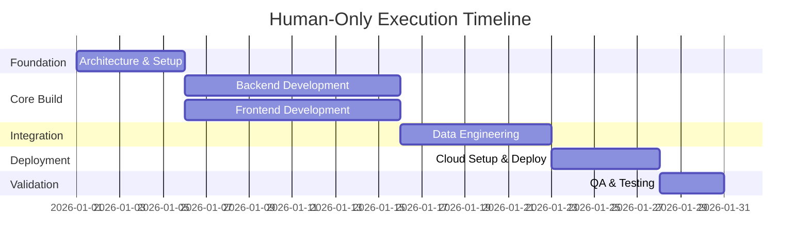

# Effort Estimation -- 3 Scenarios

## Project: [name]
## Date: [date]
## Based on: Solution Proposal v[X]

---

## Scenario A: Human-Only Execution

### Team Composition

| Role | Count | Dedication | Hours/Week | Total Hours | Duration |
|------|-------|-----------|------------|-------------|----------|
| [role] | [N] | [%] | [Xh] | [Yh] | [Z weeks] |

### Effort Breakdown by Specialist/Slice

| Specialist | Slice | Mapped Role | Complexity | Est. Hours (range) |
|-----------|-------|------------|-----------|-------------------|
| [spec-name] | [slice description] | [role] | Low/Med/High | [X-Y]h |

### Timeline

### Summary
- **Total effort:** [X-Y] person-hours
- **Calendar time:** [X-Y] weeks
- **Team size:** [N] people (peak [M])
- **Key assumptions:**
  - [assumption 1]
  - [assumption 2]

---

## Scenario B: Bridge-Only Execution

### Autonomy Assessment

| Specialist | Slice | Capability | What Bridge Does | What Human Does |
|-----------|-------|-----------|-----------------|----------------|
| [spec-name] | [slice] | FULL/GUIDED/PARTIAL/SUPERVISION | [description] | [description] |

### Token & Cost Estimate

| Phase/Agent | Input Tokens | Output Tokens | Model | Est. Cost (USD) |
|-------------|-------------|---------------|-------|----------------|
| Phase 1: Translator | ~[X]K | ~[Y]K | Sonnet | $[Z] |
| Phase 2: Researcher | ~[X]K | ~[Y]K | Sonnet | $[Z] |
| Phase 3: Architect | ~[X]K | ~[Y]K | Opus | $[Z] |
| Phase 3: Effort Estimator | ~[X]K | ~[Y]K | Opus | $[Z] |
| Phase 4: [specialist] | ~[X]K | ~[Y]K | [model] | $[Z] |
| Phase 5: Validators | ~[X]K | ~[Y]K | Opus | $[Z] |
| **TOTAL** | **~[X]K** | **~[Y]K** | -- | **$[Z]** |

**Token pricing (current):**
| Model | Input/1M | Output/1M |
|-------|---------|----------|
| Opus | $15.00 | $75.00 |
| Sonnet | $3.00 | $15.00 |
| Haiku | $0.80 | $4.00 |

### Time Estimate

| Phase | Est. Duration | Human Attention Required |
|-------|--------------|------------------------|
| Phases 0-3 (Design) | [X-Y] min | Approval gates (~[Z] min) |
| Phase 4 (Build) | [X-Y] min | Reviews per group (~[Z] min) |
| Phase 5 (Validate) | [X-Y] min | Final review (~[Z] min) |
| **Total** | **[X-Y] min** | **~[Z] min total** |

### Feasibility Verdict

- **Can Bridge build this autonomously?** [YES / MOSTLY / PARTIALLY / NO]
- **% of slices fully autonomous:** [X]%
- **% of slices guided (Bridge codes, human deploys):** [X]%
- **% requiring significant human work:** [X]%
- **Blockers for full autonomy:**
  - [blocker 1]
  - [blocker 2]

---

## Scenario C: Hybrid Execution (Recommended)

### Work Split

| Specialist | Slice | Executor | Bridge Tokens (In/Out) | Human Hours | Notes |
|-----------|-------|----------|----------------------|-------------|-------|
| [spec-name] | [slice] | Bridge/Human/Both | [X]K/[Y]K | [Z]h | [notes] |

### Bridge Investment

- **Total input tokens:** [X]K (±30%)
- **Total output tokens:** [Y]K (±30%)
- **Estimated cost:** $[Z] (±30%)
- **Bridge execution time:** [T] minutes

### Human Investment

| Role | Hours | Focus Areas |
|------|-------|------------|
| [role] | [X]h | [what they focus on] |

### Combined Timeline

| Day/Week | Bridge Activity | Human Activity |
|----------|----------------|---------------|
| [period] | [what Bridge does] | [what humans do] |

---

## Comparison Summary

| Metric | Human-Only (A) | Bridge-Only (B) | Hybrid (C) |
|--------|---------------|-----------------|------------|
| Calendar time | [X] weeks | [Y] hours | [Z] days |
| Total human hours | [A]h | [B]h supervision | [C]h |
| Token cost (USD) | $0 | $[X] | $[Y] |
| Team size (peak) | [N] people | 1 supervisor | [M] people |
| Risk level | [desc] | [desc] | [desc] |
| Quality assurance | [desc] | [desc] | [desc] |
| Best suited for | [desc] | [desc] | [desc] |

## Recommendation

[2-3 paragraphs explaining which scenario is recommended and why, based on the specific project characteristics, team availability, timeline pressure, and budget constraints.]
